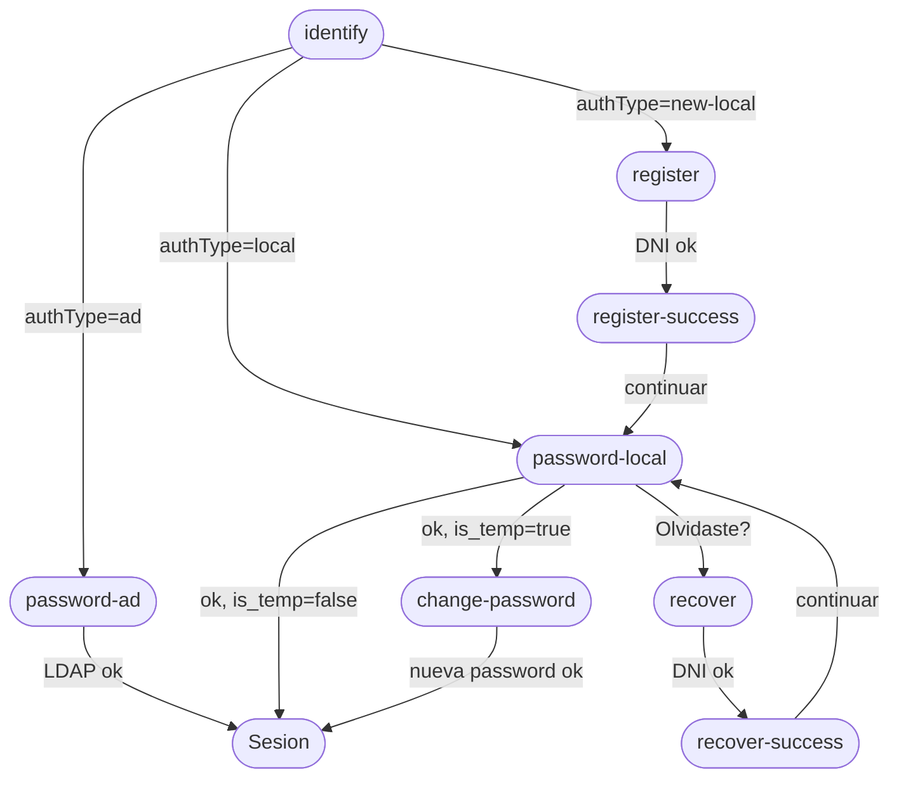

# Design Document — SAMI Auth Multistep

## Overview

SAMI v2 reemplaza el flujo de autenticación de pantalla única por un flujo multi-step inteligente. El sistema detecta el tipo de worker a partir del código SAP y adapta la experiencia: autenticación AD vía LDAP, autenticación local con Argon2id, registro de primer acceso, recuperación de contraseña y cambio obligatorio de contraseña temporal. Todo el flujo vive dentro de la pantalla de login sin rutas separadas.

### Decisiones de diseño clave

- El frontend usa una state machine explícita en lugar de rutas para evitar que estados intermedios sean bookmarkeables.
- El `tempToken` vive exclusivamente en React state para evitar persistencia en localStorage.
- El backend no revela el nombre completo del worker en ningún endpoint (solo primer nombre + inicial del apellido).
- Los workers AD no pueden recuperar contraseña desde SAMI.
- No se crea sesión cuando `is_temp_password = true`.

---

## Architecture

### Backend: Modular Monolith NestJS

El módulo `AuthModule` es un bounded context independiente. Toda la lógica vive en `AuthService`, que accede directamente a la base de datos vía Drizzle ORM.

```
AuthModule
├── AuthController   → HTTP endpoints, validación Zod via pipes
├── AuthService      → Lógica de negocio + queries Drizzle
├── LdapService      → Bind LDAP corporativo
└── EmailService     → Envío de correos transaccionales
```

### Frontend: Feature Module modules/auth/

Flujo unidireccional: View → Component → Hook → Repository → httpClient.

```
modules/auth/
├── components/
│   ├── login/
│   │   ├── LoginFlow.tsx
│   │   ├── StepIdentify.tsx
│   │   ├── StepPasswordAD.tsx
│   │   ├── StepPasswordLocal.tsx
│   │   ├── StepRegister.tsx
│   │   ├── StepRegisterSuccess.tsx
│   │   ├── StepChangePassword.tsx
│   │   ├── StepRecover.tsx
│   │   └── StepRecoverSuccess.tsx
│   └── shared/
│       ├── AuthCard.tsx
│       ├── PasswordInput.tsx
│       ├── PasswordRequirements.tsx
│       └── BackButton.tsx
├── hooks/
│   ├── use-auth.ts
│   ├── use-identify.ts
│   ├── use-register.ts
│   ├── use-recover.ts
│   └── use-change-password.ts
├── repository/
│   ├── auth.repository.ts
│   └── auth.api-repository.ts
└── types/
    └── auth.types.ts
```

### Diagrama de flujo



---

## Components and Interfaces

### Backend — Endpoints

**POST /api/auth/identify**
- Request: `{ sap_code: string }`
- Response 200: `{ found: true, auth_type: 'ad'|'local'|'new-local', worker_name: string }`
- Response 404: `{ message: 'Código no registrado' }`
- Response 403: `{ message: 'Cuenta inactiva' }`
- Response 429: Rate limit excedido
- `worker_name` = primer nombre + inicial del apellido (ej. "Carlos M.")

**POST /api/auth/login**
- Request: `{ sap_code: string, password: string }`
- Response 200 (AD/local sin temp): `{ requires_password_change: false, token: string }`
- Response 200 (local con temp): `{ requires_password_change: true, temp_token: string }`
- Response 401: `{ message: 'Credenciales incorrectas' }`
- Response 429: Rate limit excedido

**POST /api/auth/register**
- Request: `{ sap_code: string, dni: string }`
- Response 200: `{ masked_email: string, message: string }`
- Response 400: `{ message: 'DNI incorrecto' }`
- Response 409: `{ message: 'Worker ya registrado' }`

**POST /api/auth/recover**
- Request: `{ sap_code: string, dni: string }`
- Response 200: `{ masked_email: string, message: string }`
- Response 400: `{ message: 'DNI incorrecto' }`
- Response 403: `{ message: 'Los usuarios corporativos no pueden recuperar contraseña desde SAMI' }`

**POST /api/auth/change-password**
- Request: `{ temp_token: string, new_password: string, confirm_password: string }`
- Response 200: `{ token: string }`
- Response 400: `{ message: 'Las contraseñas no coinciden' }`
- Response 401: `{ message: 'Token inválido o expirado' }`

### Frontend — Repository Interface

```ts
interface AuthRepository {
  identify(sapCode: string): Promise<IdentifyResult>
  login(sapCode: string, password: string): Promise<LoginResult>
  register(sapCode: string, dni: string): Promise<RegisterResult>
  recover(sapCode: string, dni: string): Promise<RecoverResult>
  changePassword(tempToken: string, newPassword: string, confirmPassword: string): Promise<{ token: string }>
}
```

### Frontend — State Machine

```ts
type LoginStep =
  | { step: 'identify' }
  | { step: 'password-ad'; sapCode: string; workerName: string }
  | { step: 'password-local'; sapCode: string; workerName: string }
  | { step: 'register'; sapCode: string; workerName: string }
  | { step: 'register-success'; maskedEmail: string; sapCode: string }
  | { step: 'recover'; sapCode: string; workerName: string }
  | { step: 'recover-success'; maskedEmail: string; sapCode: string }
  | { step: 'change-password'; tempToken: string }
```

`LoginFlow.tsx` mantiene `currentStep: LoginStep` en `useState`. Las transiciones son funciones puras. El `tempToken` nunca sale del componente hacia localStorage.

---

## Data Models

### Maestro SAP (read-only) — `eiis_trabajadores`

Los datos del worker para el flujo de auth se leen de esta tabla en **SAP_DB** (staging / réplica). No hay migraciones Drizzle en SAP; el schema vive en `apps/backend/src/core/database/schema-sap/`.

| Campo API / lógica | Columna SAP | Notas |
|--------------------|-------------|--------|
| `sap_code` (body HTTP) | `pernr` | Identificador del trabajador |
| Activo para login | `stat2` | **3 = activo**; otros valores (p. ej. **0 = baja**) ⇒ HTTP 403 "Cuenta inactiva" |
| ¿AD? | `correo_corp` | Texto no vacío (trim) ⇒ `auth_type: ad` |
| Nombre mostrado | `vorna`, `nachn` | Formato "Nombre I." (privacidad) |
| DNI en registro/recover | `perid` | Comparar con normalización acordada (p. ej. solo dígitos) |
| Email temp password | `correo` | Debe existir para registro/recover local; si falta, error controlado |
| Histórico | `begda`, `endda`, `id_registro` | Si hay varias filas por `pernr`, elegir la vigente o la más reciente |

**LDAP / AD:** la búsqueda en directorio usa el **mismo código SAP** (`sap_code` / `pernr`), típicamente mapeado a un atributo AD configurable (p. ej. `postalCode`), no al bind con `correo_corp`.

### Tabla local_auth — nueva tabla (reemplaza worker_auth para credenciales locales)

```sql
CREATE TABLE local_auth (
  sap_code              VARCHAR(20) PRIMARY KEY,  -- = pernr en eiis_trabajadores (SAP staging)
  password_hash         TEXT NOT NULL,            -- solo existe para workers sin AD
  is_temp_password      BOOLEAN DEFAULT FALSE,
  temp_token            UUID,
  temp_token_expires_at TIMESTAMPTZ,
  created_at            TIMESTAMPTZ DEFAULT now(),
  updated_at            TIMESTAMPTZ DEFAULT now()
);
```

**Principio de diseño:** La fila en `local_auth` solo existe para workers sin AD (aprox. 30-40% del total). El `auth_method` NO se almacena — se determina en runtime consultando SAP staging: primero **`stat2` activo**, luego **`correo_corp` presente → AD**, ausente/vacío → local. Esto evita desincronización si un worker recibe correo corporativo después del registro.

### Schema Drizzle

```ts
export const localAuth = pgTable('local_auth', {
  sapCode:            varchar('sap_code', { length: 20 }).primaryKey(),
  passwordHash:       text('password_hash').notNull(),
  isTempPassword:     boolean('is_temp_password').default(false).notNull(),
  tempToken:          uuid('temp_token'),
  tempTokenExpiresAt: timestamp('temp_token_expires_at', { withTimezone: true }),
  createdAt:          timestamp('created_at', { withTimezone: true }).defaultNow().notNull(),
  updatedAt:          timestamp('updated_at', { withTimezone: true }).defaultNow().notNull(),
})
```

### DTOs (snake_case — contrato HTTP)

```ts
interface IdentifyResponseDTO {
  found: boolean
  auth_type?: 'ad' | 'local' | 'new-local'
  worker_name?: string
  message?: string
}
interface LoginResponseDTO {
  requires_password_change: boolean
  token?: string
  temp_token?: string
}
interface RegisterResponseDTO { masked_email: string; message: string }
interface RecoverResponseDTO  { masked_email: string; message: string }
interface ChangePasswordResponseDTO { token: string }
```

### Tipos de dominio frontend (camelCase — modelo interno)

```ts
interface IdentifyResult {
  found: boolean
  authType?: 'ad' | 'local' | 'new-local'
  workerName?: string
  message?: string
}
interface LoginResult {
  requiresPasswordChange: boolean
  token?: string
  tempToken?: string
}
interface RegisterResult { maskedEmail: string; message: string }
interface RecoverResult  { maskedEmail: string; message: string }
```

### Validaciones Zod (backend)

```ts
const identifySchema = z.object({
  sap_code: z.string().regex(/^\d+$/).min(1),
})
const loginSchema = z.object({
  sap_code: z.string().regex(/^\d+$/).min(1),
  password: z.string().min(1),
})
const registerSchema = z.object({
  sap_code: z.string().regex(/^\d+$/).min(1),
  dni: z.string().regex(/^\d{8}$/),
})
const recoverSchema = registerSchema
const changePasswordSchema = z.object({
  temp_token: z.string().uuid(),
  new_password: z.string().min(8).regex(/[A-Z]/).regex(/[0-9]/),
  confirm_password: z.string(),
}).refine(d => d.new_password === d.confirm_password, {
  message: 'Las contraseñas no coinciden',
  path: ['confirm_password'],
})
```

---


## Correctness Properties

*A property is a characteristic or behavior that should hold true across all valid executions of a system — essentially, a formal statement about what the system should do. Properties serve as the bridge between human-readable specifications and machine-verifiable correctness guarantees.*

### Property 1: Clasificación correcta de workers

*For any* SAP code válido enviado a `/api/auth/identify` cuyo `pernr` existe en `eiis_trabajadores` con **`stat2` activo**, el `auth_type` retornado debe corresponder exactamente al estado del worker: `ad` si `correo_corp` presente y no vacío, `local` si `correo_corp` está ausente/vacío y existe fila en `local_auth`, y `new-local` si `correo_corp` está ausente/vacío y no existe fila en `local_auth`. El `auth_method` nunca se lee de la BD local. Si `stat2` no es activo, la respuesta debe ser HTTP 403 antes de clasificar `auth_type`.

**Validates: Requirements 1.1, 1.2, 1.3, 1.4**

### Property 2: Privacidad del nombre del worker

*For any* worker en el sistema, el campo `worker_name` retornado por cualquier endpoint del flujo de autenticación debe contener únicamente el primer nombre y la inicial del apellido (formato "Nombre I."), nunca el nombre completo.

**Validates: Requirements 1.7, 10.6**

### Property 3: Autenticación AD exitosa no requiere cambio de contraseña

*For any* AD worker con credenciales LDAP válidas, la respuesta de `/api/auth/login` debe incluir un token de sesión y `requires_password_change: false`, nunca un `temp_token`.

**Validates: Requirements 2.1, 2.2, 2.4**

### Property 4: Autenticación local sin contraseña temporal crea sesión

*For any* local worker con `is_temp_password = false` y password correcta, la respuesta de `/api/auth/login` debe incluir un token de sesión y `requires_password_change: false`.

**Validates: Requirements 3.1, 3.2**

### Property 5: Contraseña temporal no genera sesión

*For any* local worker con `is_temp_password = true` y password correcta, la respuesta de `/api/auth/login` debe incluir `requires_password_change: true` y un `temp_token`, pero nunca un token de sesión.

**Validates: Requirements 3.3, 10.5**

### Property 6: Generación y almacenamiento de contraseña temporal

*For any* new local worker (registro) o existing local worker (recuperación) con DNI correcto, después de llamar a `/api/auth/register` o `/api/auth/recover`, debe existir una fila en `local_auth` con un `password_hash` verificable con Argon2id y `is_temp_password = true`.

**Validates: Requirements 4.1, 4.2, 4.3, 5.1, 5.2**

### Property 7: Formato de correo enmascarado

*For any* operación de registro o recuperación exitosa, el `masked_email` retornado debe mostrar exactamente los primeros 2 caracteres del usuario, asteriscos para los caracteres intermedios, y el dominio completo visible (ej. `ca***@empresa.com`).

**Validates: Requirements 4.6, 5.4**

### Property 8: Cambio de contraseña limpia estado temporal

*For any* `temp_token` válido y no expirado, después de un cambio de contraseña exitoso en `/api/auth/change-password`, la fila en `local_auth` debe tener `is_temp_password = false`, `temp_token = null` y `temp_token_expires_at = null`, y la respuesta debe incluir un token de sesión.

**Validates: Requirements 6.1, 6.2, 6.3**

### Property 9: Temp token de un solo uso

*For any* `temp_token` que ya fue usado exitosamente en `/api/auth/change-password`, un segundo intento con el mismo token debe retornar HTTP 401.

**Validates: Requirements 6.6**

### Property 10: Transiciones de state machine según authType

*For any* respuesta de `/api/auth/identify` con un `authType` dado, el `LoginFlow` debe transicionar al paso correcto: `password-ad` para `ad`, `password-local` para `local`, `register` para `new-local`. Cuando `/api/auth/login` retorna `requiresPasswordChange: true`, el estado debe ser `change-password` con el `tempToken` almacenado en React state.

**Validates: Requirements 8.1, 8.2, 8.3, 8.4, 8.5**

### Property 11: Temp token no persiste en localStorage

*For any* flujo de autenticación que involucre un `tempToken`, `localStorage` no debe contener el token en ningún momento del flujo.

**Validates: Requirements 8.6**

### Property 12: Validaciones Zod rechazan inputs inválidos

*For any* request a los endpoints de autenticación con datos que violen las reglas de validación (SAP code no numérico, DNI con distinto de 8 dígitos, password sin mayúscula o número, passwords que no coinciden), el sistema debe retornar HTTP 400 con detalles del campo inválido.

**Validates: Requirements 9.1, 9.2, 9.3, 9.4, 9.5, 9.6**

### Property 13: Formato de tokens de seguridad

*For any* temp password generada, debe tener exactamente 8 caracteres alfanuméricos. *For any* temp token generado, debe ser un UUID v4 válido.

**Validates: Requirements 10.2, 10.3**

### Property 14: Hash Argon2id round trip

*For any* password en texto plano, hashearla con Argon2id y luego verificar el hash contra la misma password debe retornar `true`; verificar contra cualquier otra password debe retornar `false`.

**Validates: Requirements 10.4**

---

## Error Handling

### Backend

| Escenario | HTTP | Mensaje |
|-----------|------|---------|
| SAP code no registrado | 404 | "Código no registrado" |
| Worker inactivo (`stat2` no activo) | 403 | "Cuenta inactiva" |
| Rate limit excedido | 429 | (estándar) |
| Credenciales incorrectas (AD o local) | 401 | "Credenciales incorrectas" |
| DNI incorrecto | 400 | "DNI incorrecto" |
| Worker ya registrado | 409 | "Worker ya registrado" |
| AD worker intenta recover | 403 | "Los usuarios corporativos no pueden recuperar contraseña desde SAMI" |
| tempToken inválido o expirado | 401 | "Token inválido o expirado" |
| Passwords no coinciden | 400 | "Las contraseñas no coinciden" |
| Validación Zod falla | 400 | Detalles de campos inválidos |

### Principios de error handling

- Los errores de autenticación (401) no revelan si el SAP code existe o no para evitar enumeración de usuarios.
- Los errores de validación (400) incluyen el nombre del campo inválido para UX, pero no datos internos del sistema.
- El `LdapService` debe capturar excepciones de conexión LDAP y relanzarlas como errores controlados (no exponer detalles de infraestructura).
- El `EmailService` en producción debe loggear errores de envío sin interrumpir el flujo; en dev usa `console.log` como fallback.
- Los errores de BD (Drizzle) deben ser capturados en `AuthService` y convertidos a excepciones NestJS apropiadas.

### Frontend

- Cada hook (`useIdentify`, `useAuth`, etc.) expone el estado de error de TanStack Query.
- Los componentes Step muestran mensajes de error inline (no toasts) para mantener el contexto del paso actual.
- En caso de error de red, el usuario puede reintentar desde el mismo paso sin perder el estado de la state machine.
- El `tempToken` se descarta del state si el usuario navega fuera del flujo de cambio de contraseña.

---

## Testing Strategy

### Enfoque dual: Unit tests + Property-based tests

Ambos tipos son complementarios y necesarios para cobertura completa:
- **Unit tests**: ejemplos específicos, casos de integración, edge cases y condiciones de error.
- **Property tests**: propiedades universales que deben cumplirse para cualquier input válido.

### Property-Based Testing

**Librería seleccionada:**
- Backend (NestJS/TypeScript): `fast-check`
- Frontend (React/TypeScript): `fast-check`

**Configuración mínima:** 100 iteraciones por propiedad.

**Tag format:** `Feature: sami-auth-multistep, Property {N}: {texto}`

Cada propiedad del documento debe ser implementada por exactamente un test de propiedad:

| Propiedad | Test |
|-----------|------|
| P1: Clasificación de workers | Generar workers aleatorios con distintos estados, verificar auth_type |
| P2: Privacidad del nombre | Generar workers con nombres aleatorios, verificar formato "Nombre I." |
| P3: Auth AD sin cambio de password | Generar AD workers con credenciales válidas (mock LDAP), verificar respuesta |
| P4: Auth local sin temp password | Generar local workers con is_temp=false, verificar token de sesión |
| P5: Temp password no genera sesión | Generar local workers con is_temp=true, verificar ausencia de token |
| P6: Generación de temp password | Generar workers con DNI correcto, verificar estado post-registro/recover |
| P7: Formato masked_email | Generar emails aleatorios, verificar formato de enmascaramiento |
| P8: Cambio de password limpia estado | Generar tempTokens válidos, verificar estado post-cambio |
| P9: Temp token de un solo uso | Usar mismo token dos veces, verificar 401 en segundo intento |
| P10: Transiciones state machine | Generar respuestas de identify/login, verificar estado resultante |
| P11: tempToken no en localStorage | Ejecutar flujo completo, verificar localStorage vacío |
| P12: Validaciones Zod | Generar inputs inválidos, verificar HTTP 400 |
| P13: Formato de tokens | Generar N tokens, verificar longitud/formato |
| P14: Argon2id round trip | Generar passwords aleatorias, verificar hash/verify |

### Unit Tests

Enfocados en:
- Integración entre `AuthController` y `AuthService` (request/response mapping)
- Integración entre `AuthService` y `LdapService` (mock LDAP)
- Integración entre `AuthService` y `EmailService` (mock email)
- Edge cases: worker inactivo, token expirado, AD worker en recover
- Ejemplos específicos: schema de BD con las 3 nuevas columnas, eliminación de LoginForm/RegisterForm

### Cobertura mínima esperada

- `AuthService`: 90%+ (lógica de negocio crítica)
- `AuthController`: 80%+ (validaciones y mapeo)
- `auth.api-repository.ts`: 80%+ (mappers DTO → dominio)
- `LoginFlow.tsx` state machine: 90%+ (todas las transiciones)
