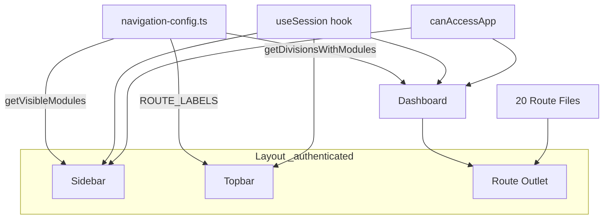
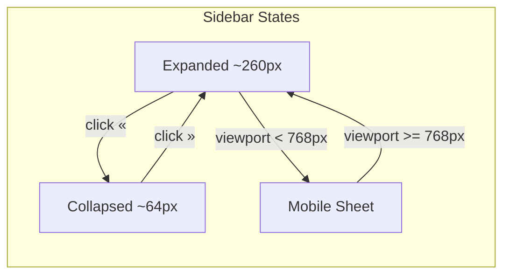

# Design Document — SAMI Dashboard & Sidebar

> **Copia de trabajo** en el monorepo `sami-V2` (origen: `Proyecto/Kiro/sami-spec.v01`). Rutas de código: prefijo `apps/frontend/`.

## Alineación con SAMI v2 (revisión — aplicar al implementar)

- **`GET /api/auth/me`**: El contrato actual en frontend es `MeDto` / `authRepository.getMe()`: `sap_code`, `worker_name`, `worker_id`, `division`, `subdivision`, `is_superadmin`, `app_roles[]` (objetos con `app_slug`, `module_slug`, `role_slug`, etc.). **No** coincide con el ejemplo anidado `worker: { firstName, lastName, position, … }` del spec fuente. Opciones: extender backend; o derivar nombre/apellido/puesto desde `worker_name` y SAP con reglas explícitas; o mostrar solo `worker_name` hasta nuevos campos.
- **`useSession`**: Usar `httpClient` + `authRepository` existentes, no `fetch('/api/auth/me')` directo.
- **`canAccessApp`**: Ubicación sugerida `apps/frontend/src/infrastructure/auth/permissions.ts` (consumir `appRoles` ya mapeados). Con `RBAC_ENABLED=false`, puede devolver `true` para todas las apps como indica el spec.
- **Rutas**: Archivos bajo `apps/frontend/src/routes/…`. El path URL final (p. ej. `/dashboard` + hijos) debe cuadrar con el layout `_authenticated` y el `routeTree` generado por TanStack Router.
- **Slug vs segmento URL**: La app “Reportes SO” usa `slug: 'reportes-so'` pero `path: '/salud-ocupacional/reportes'` — los breadcrumbs deben mapear el **segmento de ruta** (`reportes`), no confundir con el slug de negocio.

---

## Overview

SAMI v2 necesita un sistema de navegación completo: un Dashboard principal que organiza el acceso por División → Módulo → App, un Sidebar con accordion que organiza por Módulo → App, una Topbar con breadcrumbs dinámicos, y 20 route files placeholder. Todo el sistema filtra contenido según permisos RBAC via `canAccessApp()` y se integra con TanStack Router file-based.

### Decisiones de diseño clave

- **Single source of truth**: `navigation-config.ts` centraliza el catálogo completo; Dashboard, Sidebar y Topbar lo consumen.
- **Thin route files**: los 20 archivos de ruta son placeholders mínimos con `beforeLoad` guard — sin lógica de negocio.
- **Accordion con localStorage**: el módulo activo persiste entre navegaciones bajo la clave `"sami-sidebar-active-module"`.
- **Mobile-first Sheet**: en viewport < 768px el Sidebar se convierte en un drawer con backdrop; se cierra automáticamente al navegar.
- **Session shape para UI**: `useSession()` debe basarse en `authRepository.getMe()` (ver bloque *Session type mapping*). Mínimo: `sapCode`, `workerName`, `isSuperadmin`, `appRoles`. `firstName`, `lastName`, `position` son opcionales hasta que el backend los exponga o se deriven de `worker_name`.
- **RBAC_ENABLED = false**: `canAccessApp()` retorna `true` para todos en esta fase.

---

## Architecture

### Estructura de carpetas

```
apps/frontend/src/
├── routes/
│   └── _authenticated/
│       ├── dashboard.tsx                        # Dashboard principal
│       ├── horas-extra/
│       │   ├── registro-horas-extra.tsx
│       │   └── gestion-roles-he.tsx
│       ├── salud-ocupacional/
│       │   ├── registro-consulta.tsx
│       │   ├── mis-consultas.tsx
│       │   ├── descanso-medico.tsx
│       │   ├── inventario-medico.tsx
│       │   ├── historial-medico.tsx
│       │   └── reportes.tsx
│       ├── visitas/
│       │   ├── registro-visita.tsx
│       │   └── portal-central.tsx
│       ├── crm-quimicos/
│       │   └── dashboard-crm.tsx
│       ├── sistemas/
│       │   ├── asignacion-bienes.tsx
│       │   ├── registro-productividad.tsx
│       │   └── mis-equipos.tsx
│       └── administracion/
│           ├── gestion-usuarios.tsx
│           ├── roles.tsx
│           ├── asignaciones.tsx
└── shared/
    └── components/
        ├── sidebar/
        │   ├── navigation-config.ts             # Single source of truth
        │   ├── Sidebar.tsx
        │   └── SidebarFooter.tsx
        ├── dashboard/
        │   └── Dashboard.tsx
        └── topbar/
            └── Topbar.tsx
```

*(Alternativa coherente con el repo: colocar shell bajo `apps/frontend/src/modules/shell/` si el equipo prefiere agrupar layout ahí.)*

### Diagrama de componentes





---

## Components and Interfaces

### navigation-config.ts

Archivo: `apps/frontend/src/shared/components/sidebar/navigation-config.ts`

```typescript
import type { LucideIcon } from 'lucide-react'

// ─── Interfaces ───────────────────────────────────────────────────────────────

export interface NavApp {
  slug: string
  label: string
  path: string
  description: string
  icon: string // nombre del icono lucide-react
}

export interface NavModule {
  slug: string
  label: string
  icon: string // nombre del icono lucide-react
  divisionCode: string
  apps: NavApp[]
}

export interface NavDivision {
  code: string
  label: string
  modules: string[] // slugs de módulos
}

// ─── Catálogo de Divisiones ───────────────────────────────────────────────────

export const DIVISIONS: NavDivision[] = [
  { code: 'AR10', label: 'Textil',                    modules: [] },
  { code: 'AR20', label: 'Cerámicos',                 modules: [] },
  { code: 'AR30', label: 'Químicos',                  modules: ['crm-quimicos'] },
  { code: 'AR40', label: 'Agropunto',                 modules: [] },
  { code: 'AR50', label: 'Trade Agrícola',            modules: [] },
  { code: 'AR80', label: 'Operaciones',               modules: ['salud-ocupacional', 'horas-extra', 'visitas'] },
  { code: 'AR90', label: 'Administración y Finanzas', modules: ['sistemas', 'administracion'] },
]

// ─── Catálogo de Módulos ──────────────────────────────────────────────────────

export const MODULES: NavModule[] = [
  {
    slug: 'horas-extra',
    label: 'Horas Extra',
    icon: 'Clock',
    divisionCode: 'AR80',
    apps: [
      { slug: 'registro-horas-extra', label: 'Registro de Horas Extra',  path: '/horas-extra/registro-horas-extra', description: 'Registra las horas extra trabajadas',       icon: 'FileClock' },
      { slug: 'gestion-roles-he',     label: 'Gestión de Roles HE',      path: '/horas-extra/gestion-roles-he',     description: 'Administra los roles de horas extra',      icon: 'UserCog'   },
    ],
  },
  {
    slug: 'salud-ocupacional',
    label: 'Salud Ocupacional',
    icon: 'Heart',
    divisionCode: 'AR80',
    apps: [
      { slug: 'registro-consulta',  label: 'Registro de Consulta',  path: '/salud-ocupacional/registro-consulta',  description: 'Registra consultas médicas',              icon: 'Stethoscope'   },
      { slug: 'mis-consultas',      label: 'Mis Consultas',         path: '/salud-ocupacional/mis-consultas',      description: 'Historial de consultas del worker',       icon: 'ClipboardList' },
      { slug: 'descanso-medico',    label: 'Descanso Médico',       path: '/salud-ocupacional/descanso-medico',    description: 'Gestión de descansos médicos',            icon: 'BedDouble'     },
      { slug: 'inventario-medico',  label: 'Inventario Médico',     path: '/salud-ocupacional/inventario-medico',  description: 'Control de inventario médico',            icon: 'Pill'          },
      { slug: 'historial-medico',   label: 'Historial Médico',      path: '/salud-ocupacional/historial-medico',   description: 'Historial médico del worker',             icon: 'FileHeart'     },
      { slug: 'reportes-so',        label: 'Reportes',              path: '/salud-ocupacional/reportes',           description: 'Reportes de salud ocupacional',           icon: 'BarChart3'     },
    ],
  },
  {
    slug: 'visitas',
    label: 'Visitas',
    icon: 'DoorOpen',
    divisionCode: 'AR80',
    apps: [
      { slug: 'registro-visita', label: 'Registro de Visita', path: '/visitas/registro-visita', description: 'Registra visitas al centro de trabajo', icon: 'UserPlus' },
      { slug: 'portal-central',  label: 'Portal Central',     path: '/visitas/portal-central',  description: 'Portal central de visitas',             icon: 'Globe'    },
    ],
  },
  {
    slug: 'crm-quimicos',
    label: 'CRM Químicos',
    icon: 'FlaskConical',
    divisionCode: 'AR30',
    apps: [
      { slug: 'dashboard-crm', label: 'Dashboard CRM', path: '/crm-quimicos/dashboard-crm', description: 'Panel principal del CRM Químicos', icon: 'LayoutDashboard' },
    ],
  },
  {
    slug: 'sistemas',
    label: 'Sistemas',
    icon: 'Monitor',
    divisionCode: 'AR90',
    apps: [
      { slug: 'asignacion-bienes',       label: 'Asignación de Bienes',       path: '/sistemas/asignacion-bienes',       description: 'Gestión de asignación de bienes',       icon: 'Laptop'      },
      { slug: 'registro-productividad',  label: 'Registro de Productividad',  path: '/sistemas/registro-productividad',  description: 'Registro de productividad del equipo',  icon: 'TrendingUp'  },
      { slug: 'mis-equipos',             label: 'Mis Equipos',                path: '/sistemas/mis-equipos',             description: 'Equipos asignados al worker',           icon: 'PackageCheck'},
    ],
  },
  {
    slug: 'administracion',
    label: 'Administración',
    icon: 'Settings',
    divisionCode: 'AR90',
    apps: [
      { slug: 'gestion-usuarios', label: 'Gestión de Usuarios', path: '/administracion/gestion-usuarios', description: 'Administración de usuarios del sistema', icon: 'Users'     },
      { slug: 'roles',            label: 'Roles',               path: '/administracion/roles',            description: 'Gestión de roles y permisos',           icon: 'Shield'    },
      { slug: 'asignaciones',     label: 'Asignaciones',        path: '/administracion/asignaciones',     description: 'Asignación de roles a workers',         icon: 'Link'      },
    ],
  },
]

// ─── Helpers ──────────────────────────────────────────────────────────────────

/**
 * Retorna las divisiones con sus módulos y apps filtrados por permisos.
 * Excluye divisiones que no tengan ningún módulo visible tras el filtrado.
 */
export function getDivisionsWithModules(
  canAccess: (appSlug: string) => boolean
): Array<NavDivision & { resolvedModules: Array<NavModule & { visibleApps: NavApp[] }> }> {
  return DIVISIONS.flatMap((division) => {
    const resolvedModules = division.modules.flatMap((moduleSlug) => {
      const mod = MODULES.find((m) => m.slug === moduleSlug)
      if (!mod) return []
      const visibleApps = mod.apps.filter((app) => canAccess(app.slug))
      if (visibleApps.length === 0) return []
      return [{ ...mod, visibleApps }]
    })
    if (resolvedModules.length === 0) return []
    return [{ ...division, resolvedModules }]
  })
}

/**
 * Retorna los módulos con sus apps filtradas por permisos, sin agrupar por división.
 * Excluye módulos que no tengan ninguna app accesible tras el filtrado.
 */
export function getVisibleModules(
  canAccess: (appSlug: string) => boolean
): Array<NavModule & { visibleApps: NavApp[] }> {
  return MODULES.flatMap((mod) => {
    const visibleApps = mod.apps.filter((app) => canAccess(app.slug))
    if (visibleApps.length === 0) return []
    return [{ ...mod, visibleApps }]
  })
}
```

### Session type mapping

Archivo sugerido: `apps/frontend/src/shared/hooks/useSession.ts`, o reutilizar/ extender el hook existente del módulo auth si ya centraliza `getMe()`.

El backend expone `GET auth/me` y el frontend ya lo mapea en `apps/frontend/src/modules/auth/repository/auth.api-repository.ts` a un `MeResult` con camelCase (`sapCode`, `workerName`, `workerId`, `division`, `subdivision`, `isSuperadmin`, `appRoles[]` con objetos por rol).

```typescript
// Referencia: salida de authRepository.getMe() (no usar fetch directo)
interface MeResult {
  sapCode: string
  workerName: string
  workerId: string
  division: { code: string; name: string | null } | null
  subdivision: { code: string; name: string | null } | null
  isSuperadmin: boolean
  appRoles: Array<{
    appSlug: string
    moduleSlug: string
    roleSlug: string
    roleLevel: number
    scope: string
    scopeId: string | null
    permissions: Record<string, string[]>
  }>
}

// Shape que pueden consumir Dashboard / Topbar / footer (extender según necesidad)
export interface SessionData {
  sapCode: string
  workerName: string
  firstName: string   // '' o derivado de worker_name hasta nuevos campos API
  lastName: string
  position: string
  isSuperadmin: boolean
  /** Para RBAC: derivar lista de slugs desde appRoles + reglas de negocio, o usar objetos completos en canAccessApp */
  accessibleAppSlugs: string[]
}

function mapMeToSessionData(r: MeResult): SessionData {
  // Ejemplo: parseo opcional de worker_name "Apellido, Nombre" — definir regla explícita con producto
  return {
    sapCode: r.sapCode,
    workerName: r.workerName,
    firstName: '',
    lastName: '',
    position: '',
    isSuperadmin: r.isSuperadmin,
    accessibleAppSlugs: r.isSuperadmin
      ? [] /* superadmin: canAccessApp puede ignorar lista */
      : [...new Set(r.appRoles.map((ar) => ar.appSlug))],
  }
}
```

Hook (patrón):

```typescript
export function useSession() {
  return useQuery({
    queryKey: ['session', 'me'],
    queryFn: async () => {
      const me = await authRepository.getMe()
      if (!me) throw new Error('Unauthorized')
      return mapMeToSessionData(me)
    },
    staleTime: 5 * 60 * 1000,
  })
}
```

### Props interfaces de componentes

```typescript
// ─── Dashboard ────────────────────────────────────────────────────────────────
interface DashboardProps {
  // Sin props externas — consume useSession() y canAccessApp() internamente
}

// ─── Sidebar ──────────────────────────────────────────────────────────────────
interface SidebarProps {
  isCollapsed: boolean
  onToggleCollapse: () => void
  isMobileOpen: boolean
  onMobileClose: () => void
}

// ─── Topbar ───────────────────────────────────────────────────────────────────
interface TopbarProps {
  onMobileMenuOpen: () => void
}

// ─── SidebarFooter ────────────────────────────────────────────────────────────
interface SidebarFooterProps {
  session: SessionData
  isCollapsed: boolean
}
```

### Topbar — ROUTE_LABELS

```typescript
export const ROUTE_LABELS: Record<string, string> = {
  dashboard:               'Inicio',
  'horas-extra':           'Horas Extra',
  'registro-horas-extra':  'Registro de Horas Extra',
  'gestion-roles-he':      'Gestión de Roles HE',
  'salud-ocupacional':     'Salud Ocupacional',
  'registro-consulta':     'Registro de Consulta',
  'mis-consultas':         'Mis Consultas',
  'descanso-medico':       'Descanso Médico',
  'inventario-medico':     'Inventario Médico',
  'historial-medico':      'Historial Médico',
  reportes:                'Reportes',
  sistemas:                'Sistemas',
  'asignacion-bienes':     'Asignación de Bienes',
  'registro-productividad':'Registro de Productividad',
  'mis-equipos':           'Mis Equipos',
  'crm-quimicos':          'CRM Químicos',
  'dashboard-crm':         'Dashboard CRM',
  visitas:                 'Visitas',
  'registro-visita':       'Registro de Visita',
  'portal-central':        'Portal Central',
  administracion:          'Administración',
  'gestion-usuarios':      'Gestión de Usuarios',
  roles:                   'Roles',
  asignaciones:            'Asignaciones',
}
```

---

## Data Models

### Session

```typescript
// Payload almacenado en Redis (cookie sami_session)
interface SessionPayload {
  sapCode: string
  workerName: string
}

// Shape UI expuesta por useSession() (alinear con *Session type mapping* arriba)
interface SessionData {
  sapCode: string
  workerName: string
  firstName: string
  lastName: string
  position: string
  isSuperadmin: boolean
  /** Lista de slugs para comprobar acceso, derivada de appRoles del repositorio */
  accessibleAppSlugs: string[]
}
```

### Navigation types

```typescript
// Tipos de navegación exportados desde navigation-config.ts
type NavApp = { slug: string; label: string; path: string; description: string; icon: string }
type NavModule = { slug: string; label: string; icon: string; divisionCode: string; apps: NavApp[] }
type NavDivision = { code: string; label: string; modules: string[] }

// Tipos enriquecidos retornados por los helpers
type ResolvedModule = NavModule & { visibleApps: NavApp[] }
type ResolvedDivision = NavDivision & { resolvedModules: ResolvedModule[] }
```

### Sidebar state

```typescript
// Estado local del Sidebar (gestionado en el layout _authenticated)
interface SidebarState {
  isCollapsed: boolean          // persiste en localStorage "sami-sidebar-collapsed"
  isMobileOpen: boolean         // solo en memoria, se resetea al navegar
  activeModuleSlug: string | null  // persiste en localStorage "sami-sidebar-active-module"
}
```

---

## Correctness Properties

*A property is a characteristic or behavior that should hold true across all valid executions of a system — essentially, a formal statement about what the system should do. Properties serve as the bridge between human-readable specifications and machine-verifiable correctness guarantees.*

### Property 1: getDivisionsWithModules nunca retorna divisiones con módulos vacíos

*For any* función `canAccess`, cada división retornada por `getDivisionsWithModules(canAccess)` debe tener al menos un módulo en `resolvedModules`, y cada módulo en `resolvedModules` debe tener al menos una app en `visibleApps`.

**Validates: Requirements 1.6, 1.8**

### Property 2: getVisibleModules nunca retorna módulos con apps vacías

*For any* función `canAccess`, cada módulo retornado por `getVisibleModules(canAccess)` debe tener al menos una app en `visibleApps`.

**Validates: Requirements 1.7, 1.9**

### Property 3: canAccessApp con RBAC_ENABLED=false siempre retorna true

*For any* sesión válida y cualquier `appSlug`, cuando `RBAC_ENABLED = false`, `canAccessApp(session, appSlug)` debe retornar `true`.

**Validates: Requirements 2.2, 2.6**

### Property 4: El saludo dinámico cubre todas las horas del día

*For any* hora entre 0 y 23, la función de saludo debe retornar exactamente uno de: "Buenos días" (5–11), "Buenas tardes" (12–17), o "Buenas noches" (18–4), sin dejar ninguna hora sin cubrir.

**Validates: Requirements 3.2**

### Property 5: Las iniciales del avatar son siempre 1–2 caracteres

*For any* combinación de `firstName` y `lastName` no vacíos, o un `workerName` no vacío cuando first/last faltan, la función de cálculo de iniciales debe retornar una cadena de exactamente 1 o 2 caracteres en mayúsculas.

**Validates: Requirements 3.4, 8.1**

### Property 6: El mapeo de segmentos de ruta cubre todos los slugs del catálogo

*For any* slug definido en `ROUTE_LABELS`, la función de mapeo debe retornar una cadena no vacía en español distinta del slug original.

**Validates: Requirements 9.4**

### Property 7: El accordion del Sidebar tiene como máximo un módulo expandido

*For any* secuencia de clics en módulos del Sidebar, el estado resultante debe tener exactamente cero o un módulo expandido — nunca más de uno simultáneamente.

**Validates: Requirements 5.3**

### Property 8: localStorage round-trip del módulo activo

*For any* slug de módulo válido, después de que el Sidebar lo expanda, leer `localStorage.getItem("sami-sidebar-active-module")` debe retornar ese mismo slug.

**Validates: Requirements 5.8**

---

## Error Handling

### Sesión no disponible

- `useSession()` retorna `{ data: undefined, isLoading: true }` durante la carga inicial. Los componentes deben renderizar un skeleton o `null` hasta que `data` esté disponible.
- Si `GET /api/auth/me` falla (401/500), TanStack Query reintenta 3 veces. Tras el fallo definitivo, el layout `_authenticated` redirige a `/login`.
- Todos los accesos a campos de sesión usan el operador `??` con fallback a cadena vacía para evitar renderizar "undefined".

### Permisos y redirección

- Si `canAccessApp()` retorna `false` en `beforeLoad`, se lanza `redirect({ to: '/dashboard' })` de TanStack Router — no se usa `navigate()` para evitar renders parciales.
- Si el worker no tiene ninguna app accesible, el Dashboard muestra un estado vacío con el mensaje "No tienes apps disponibles para tu perfil actual."

### Errores de navegación

- Si un `path` en `navigation-config.ts` no coincide con ningún route file, TanStack Router renderiza el componente `NotFound` del layout. Los paths deben mantenerse sincronizados manualmente.

### Logout

- `useLogout()` implementa `onSuccess` y `onError` con la misma lógica: `queryClient.clear()` + `navigate({ to: '/login' })`. Esto garantiza que incluso si el backend falla al invalidar la sesión, el cliente queda limpio.

### localStorage

- Si `localStorage` no está disponible (SSR, modo privado extremo), el Sidebar usa `null` como estado inicial del módulo activo y no persiste. El try/catch envuelve todas las operaciones de localStorage.

---

## Testing Strategy

### Enfoque dual: unit tests + property-based tests

Ambos tipos son complementarios y necesarios:

- **Unit tests**: verifican ejemplos concretos, casos borde y condiciones de error.
- **Property tests**: verifican propiedades universales sobre rangos amplios de inputs generados.

### Librería de property-based testing

Se usa **fast-check** (compatible con Vitest):

```bash
pnpm add -D fast-check
```

Cada property test se configura con mínimo **100 iteraciones** (`numRuns: 100`).

### Unit tests (Vitest + Testing Library)

Casos concretos a cubrir:

- `navigation-config.ts`: verificar que DIVISIONS tiene 7 entradas, MODULES tiene 6 entradas, y los 20 paths están definidos.
- `getDivisionsWithModules` con `canAccess = () => true`: retorna todas las divisiones con módulos.
- `getDivisionsWithModules` con `canAccess = () => false`: retorna array vacío.
- `getVisibleModules` con `canAccess = () => true`: retorna los 6 módulos.
- `getVisibleModules` con `canAccess = () => false`: retorna array vacío.
- Dashboard: renderiza saludo correcto para hora fija (ej: 10:00 → "Buenos días").
- Dashboard: renderiza "SAMI - Sistema Administrativo Modular Integrado" cuando `position` está vacío.
- Dashboard: renderiza `position` cuando está presente.
- Sidebar: auto-expande el módulo correcto al cargar con una ruta activa.
- Sidebar: cierra el Sheet al navegar en mobile.
- Topbar: renderiza el último breadcrumb como texto plano (no Link).
- Logout: llama `queryClient.clear()` tanto en onSuccess como en onError.

### Property tests (fast-check)

Cada test referencia la propiedad del design con el tag:
`// Feature: sami-dashboard-sidebar, Property N: <texto>`

```typescript
// Property 1: getDivisionsWithModules nunca retorna divisiones con módulos vacíos
// Feature: sami-dashboard-sidebar, Property 1: getDivisionsWithModules never returns divisions with empty modules
fc.assert(
  fc.property(
    fc.func(fc.boolean()), // canAccess arbitrario
    (canAccess) => {
      const result = getDivisionsWithModules(canAccess)
      return result.every(
        (div) =>
          div.resolvedModules.length > 0 &&
          div.resolvedModules.every((mod) => mod.visibleApps.length > 0)
      )
    }
  ),
  { numRuns: 100 }
)

// Property 2: getVisibleModules nunca retorna módulos con apps vacías
// Feature: sami-dashboard-sidebar, Property 2: getVisibleModules never returns modules with empty apps
fc.assert(
  fc.property(
    fc.func(fc.boolean()),
    (canAccess) => {
      const result = getVisibleModules(canAccess)
      return result.every((mod) => mod.visibleApps.length > 0)
    }
  ),
  { numRuns: 100 }
)

// Property 3: canAccessApp con RBAC_ENABLED=false siempre retorna true
// Feature: sami-dashboard-sidebar, Property 3: canAccessApp with RBAC_ENABLED=false always returns true
fc.assert(
  fc.property(
    fc.record({
      sapCode: fc.string(),
      accessibleAppSlugs: fc.array(fc.string()),
      isSuperadmin: fc.boolean(),
    }),
    fc.string(),
    (session, appSlug) => {
      return canAccessApp(session, appSlug) === true
    }
  ),
  { numRuns: 100 }
)

// Property 4: El saludo dinámico cubre todas las horas del día
// Feature: sami-dashboard-sidebar, Property 4: greeting covers all hours
fc.assert(
  fc.property(
    fc.integer({ min: 0, max: 23 }),
    (hour) => {
      const greeting = getGreeting(hour)
      return ['Buenos días', 'Buenas tardes', 'Buenas noches'].includes(greeting)
    }
  ),
  { numRuns: 100 }
)

// Property 5: Las iniciales son siempre 1–2 caracteres en mayúsculas
// Feature: sami-dashboard-sidebar, Property 5: initials are 1-2 uppercase chars
fc.assert(
  fc.property(
    fc.string({ minLength: 1 }),
    fc.string({ minLength: 1 }),
    fc.string(),
    (firstName, lastName, workerName) => {
      const initials = getInitials(firstName, lastName, workerName)
      return initials.length >= 1 && initials.length <= 2 && initials === initials.toUpperCase()
    }
  ),
  { numRuns: 100 }
)

// Property 7: El accordion tiene como máximo un módulo expandido
// Feature: sami-dashboard-sidebar, Property 7: accordion has at most one expanded module
fc.assert(
  fc.property(
    fc.array(fc.constantFrom(...MODULES.map((m) => m.slug)), { minLength: 1, maxLength: 20 }),
    (clickSequence) => {
      let activeModule: string | null = null
      for (const slug of clickSequence) {
        activeModule = activeModule === slug ? null : slug
      }
      // El estado final tiene 0 o 1 módulo activo — nunca más de uno
      return activeModule === null || typeof activeModule === 'string'
    }
  ),
  { numRuns: 100 }
)
```

### Cobertura objetivo

| Área                    | Unit | Property |
|-------------------------|------|----------|
| navigation-config.ts    | ✓    | ✓ (P1, P2)     |
| Dashboard greeting      | ✓    | ✓ (P4) |
| Dashboard initials      | ✓    | ✓ (P5) |
| Topbar breadcrumbs      | ✓    | ✓ (P6) |
| Sidebar accordion       | ✓    | ✓ (P7) |
| Sidebar localStorage    | ✓    | ✓ (P8) |
| Route beforeLoad guard  | ✓    | — |
| Logout behavior         | ✓    | — |
