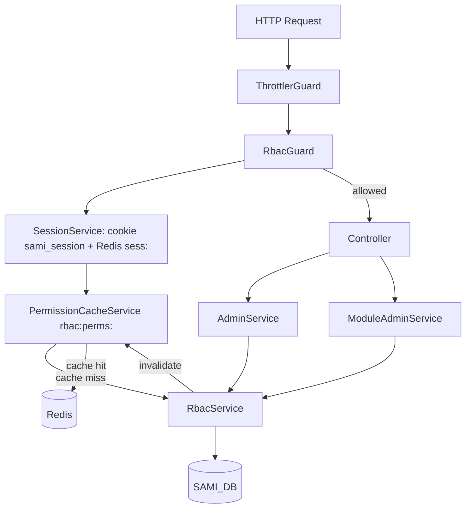
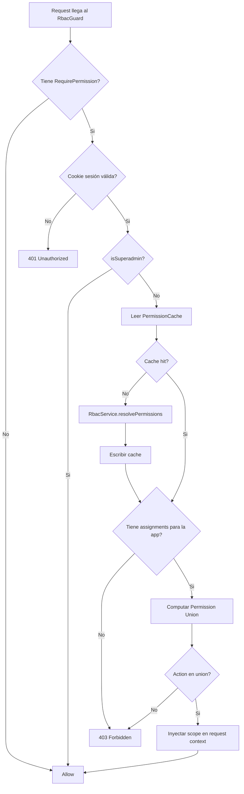

# Design Document - SAMI RBAC

## Overview

SAMI v2 implementa un sistema RBAC (Role-Based Access Control) que responde tres preguntas: QUÉ puede hacer un worker (permisos sobre features), DÓNDE puede hacerlo (scope: global, división o subdivisión), y QUIÉN lo autoriza (jerarquía de administración delegada).

### Alineación con auth y datos ya implementados (SAMI v2)

- **Identidad del worker:** `sap_code` (= `pernr` en `eiis_trabajadores`). Las columnas RBAC `worker_id` y `assigned_by` son **TEXT** y deben coincidir con `workers.id` (mismo valor; la tabla `workers` en SAMI puede seguir siendo placeholder hasta sincronización SAP).
- **Sesión:** cookie **`sami_session`** + Redis **`sess:{uuid}`** (`SessionService`); **no** `express-session`. El `RbacGuard` debe reutilizar la misma validación (cookie → Redis → `sapCode`) para obtener `worker_id` antes de leer `rbac:perms:{worker_id}`.
- **`GET /api/auth/me`:** ya existe con `sap_code` y `worker_name`; la fase RBAC **extiende** la respuesta con `is_superadmin` y `app_roles` (y opcionalmente `name` alias de `worker_name`) sin romper clientes existentes.
- **Logout:** `POST /api/auth/logout` ya revoca Redis de sesión; al implementar RBAC, conviene **invalidar** también `rbac:perms:{worker_id}` en logout.

### Decisiones de diseño clave

- **Resolución por unión**: múltiples roles activos para la misma app se combinan con unión de permisos, nunca intersección.
- **Cache Redis con TTL 5 min**: los permisos resueltos se cachean por worker para evitar queries en cada request.
- **Soft delete**: las asignaciones revocadas conservan la fila con `revoked_at` para auditoría.
- **SUPERADMIN bypass**: el guard verifica `isSuperadmin` antes de evaluar cualquier asignación.
- **Feature flag `RBAC_ENABLED`**: el frontend puede operar con RBAC desactivado sin cambios de código.
- **Jerarquía de niveles 1–5**: ningún worker puede asignar roles de nivel >= al suyo propio.

**Nota (implementación SAMI v2):** el árbol genérico `ModuleAdminController` / `module-admin.service` del diagrama inferior puede diferir del código. Hoy existe **`SuperadminGuard`** + `AdminController` (`/api/admin/*`) y, para **Salud Ocupacional**, el controlador **`SoModuleSettingsController`** bajo `/api/salud-ocupacional/module-settings/*` con **`SaludOcupacionalModuleAdminGuard`** (superadmin o `managed_module_slugs` con `salud-ocupacional`). Ver `docs/features/so-module-settings-api.md`.
- **Perfiles como plantillas**: modificar un perfil no altera asignaciones ya aplicadas (inmutabilidad de historial).
- **TEXT[] para actions**: permite agregar nuevas acciones sin migración de schema.

---

## Architecture

### Estructura de módulos backend

```
apps/backend/src/
├── core/database/schema/rbac/
│   ├── apps.ts
│   ├── app-features.ts
│   ├── roles.ts
│   ├── role-permissions.ts
│   ├── worker-role-assignments.ts
│   ├── module-profiles.ts
│   ├── module-profile-items.ts
│   ├── default-role-assignments.ts
│   └── index.ts
└── modules/rbac/   # y AuthModule en modules/auth/ (sesión)
    ├── rbac.module.ts
    ├── rbac.service.ts
    ├── permission-cache.service.ts
    ├── rbac.guard.ts
    ├── require-permission.decorator.ts
    ├── admin/
    │   ├── admin.controller.ts
    │   └── admin.service.ts
    ├── module-admin/
    │   ├── module-admin.controller.ts
    │   └── module-admin.service.ts
    └── dto/
        ├── role.dto.ts
        ├── assignment.dto.ts
        └── profile.dto.ts
```

### Estructura frontend

```
apps/frontend/src/infrastructure/auth/permissions.ts
```

### Diagrama de arquitectura



_Notas:_ el `RbacGuard` solo invoca `PermissionCacheService` en rutas con `@RequirePermission` y tras obtener `sapCode` válido; rutas sin decorator no pasan por resolución RBAC. El orden exacto de guards en `AppModule` debe evitar que el Throttler bloquee antes de tiempo; hoy el monorepo ya usa `ThrottlerGuard` global.

### Flujo de resolución de permisos



---

## Components and Interfaces

### RbacModule

```ts
import { Module, forwardRef } from '@nestjs/common';
import { APP_GUARD } from '@nestjs/core';
import { AuthModule } from '@modules/auth/auth.module';

@Module({
  imports: [DatabaseModule, forwardRef(() => AuthModule)],
  providers: [
    RbacService,
    PermissionCacheService,
    AdminService,
    ModuleAdminService,
    { provide: APP_GUARD, useClass: RbacGuard },
  ],
  controllers: [AdminController, ModuleAdminController],
  exports: [RbacService, PermissionCacheService],
})
export class RbacModule {}
```


### RequirePermission Decorator

```ts
// src/modules/rbac/require-permission.decorator.ts
import { SetMetadata } from '@nestjs/common';

export const RBAC_METADATA_KEY = 'rbac:permission';

export interface RbacPermissionMeta {
  appSlug: string;
  featureSlug: string;
  action: string;
}

export const RequirePermission = (
  appSlug: string,
  featureSlug: string,
  action: string,
) => SetMetadata(RBAC_METADATA_KEY, { appSlug, featureSlug, action });
```

### RbacGuard

```ts
// apps/backend/src/modules/rbac/rbac.guard.ts
import {
  CanActivate,
  ExecutionContext,
  Injectable,
  ForbiddenException,
  UnauthorizedException,
} from '@nestjs/common';
import { Reflector } from '@nestjs/core';
import type { Request } from 'express';
import { RBAC_METADATA_KEY, RbacPermissionMeta } from './require-permission.decorator';
import { PermissionCacheService } from './permission-cache.service';
import { SessionService } from '@modules/auth/services/session.service';

@Injectable()
export class RbacGuard implements CanActivate {
  constructor(
    private readonly reflector: Reflector,
    private readonly permCache: PermissionCacheService,
    private readonly sessions: SessionService,
  ) {}

  async canActivate(context: ExecutionContext): Promise<boolean> {
    const meta = this.reflector.getAllAndOverride<RbacPermissionMeta>(
      RBAC_METADATA_KEY,
      [context.getHandler(), context.getClass()],
    );
    if (!meta) return true;

    const request = context.switchToHttp().getRequest<Request>();
    const token = request.cookies?.sami_session as string | undefined;
    const sess = await this.sessions.validateSession(token);
    if (!sess) throw new UnauthorizedException();

    const workerId = sess.sapCode; // mismo valor que workers.id / pernr

    const cached = await this.permCache.getOrResolve(workerId);
    if (cached.isSuperadmin) {
      request.rbacScope = { scope: 'global' as const, scopeId: null };
      return true;
    }

    const appAssignments = cached.assignments.filter(
      (a) => a.appSlug === meta.appSlug,
    );
    if (appAssignments.length === 0) throw new ForbiddenException();

    const unionActions = new Set<string>();
    for (const a of appAssignments) {
      (a.permissions[meta.featureSlug] ?? []).forEach((act) => unionActions.add(act));
    }
    if (!unionActions.has(meta.action)) throw new ForbiddenException();

    const primary = appAssignments[0];
    request.rbacScope = { scope: primary.scope, scopeId: primary.scopeId ?? null };
    return true;
  }
}
```

### PermissionCacheService

```ts
// apps/backend/src/modules/rbac/permission-cache.service.ts
import { Injectable, Inject } from '@nestjs/common';
import type Redis from 'ioredis';
import { RbacService } from './rbac.service';
import { REDIS_CLIENT } from '@core/redis/redis.module';

export interface CachedPermissions {
  workerId: string;
  isSuperadmin: boolean;
  assignments: CachedAssignment[];
}

export interface CachedAssignment {
  appSlug: string;
  moduleSlug: string;
  roleSlug: string;
  roleLevel: number;
  scope: 'global' | 'division' | 'subdivision';
  scopeId: string | null;
  permissions: Record<string, string[]>; // featureSlug -> actions[]
}

const CACHE_TTL_SECONDS = 300; // 5 minutes

@Injectable()
export class PermissionCacheService {
  constructor(
    @Inject(REDIS_CLIENT) private readonly redis: Redis,
    private readonly rbacService: RbacService,
  ) {}

  private key(workerId: string): string {
    return `rbac:perms:${workerId}`;
  }

  async getOrResolve(workerId: string): Promise<CachedPermissions> {
    const raw = await this.redis.get(this.key(workerId));
    if (raw) return JSON.parse(raw) as CachedPermissions;

    const resolved = await this.rbacService.resolvePermissions(workerId);
    await this.redis.set(
      this.key(workerId),
      JSON.stringify(resolved),
      'EX',
      CACHE_TTL_SECONDS,
    );
    return resolved;
  }

  async invalidate(workerId: string): Promise<void> {
    await this.redis.del(this.key(workerId));
  }

  async invalidateByRole(roleId: string): Promise<void> {
    const workerIds = await this.rbacService.getWorkerIdsByRole(roleId);
    if (workerIds.length === 0) return;
    const keys = workerIds.map((id) => this.key(id));
    await this.redis.del(...keys);
  }
}
```


### RbacService — Permission Resolution

```ts
// apps/backend/src/modules/rbac/rbac.service.ts
import { Injectable, Inject } from '@nestjs/common';
import { eq, and, isNull } from 'drizzle-orm';
import { SAMI_DB } from '@core/database/database.module';
import {
  apps, appFeatures, roles, rolePermissions, workerRoleAssignments,
} from '@core/database/schema/rbac';
import { CachedPermissions, CachedAssignment } from './permission-cache.service';

@Injectable()
export class RbacService {
  constructor(@Inject(SAMI_DB) private readonly db: any) {}

  async resolvePermissions(workerId: string): Promise<CachedPermissions> {
    // 1. Check superadmin assignment
    const [superadminRole] = await this.db
      .select({ id: roles.id })
      .from(roles)
      .where(eq(roles.slug, 'superadmin'))
      .limit(1);

    if (superadminRole) {
      const [sa] = await this.db
        .select({ id: workerRoleAssignments.id })
        .from(workerRoleAssignments)
        .where(
          and(
            eq(workerRoleAssignments.workerId, workerId),
            eq(workerRoleAssignments.roleId, superadminRole.id),
            isNull(workerRoleAssignments.revokedAt),
          ),
        )
        .limit(1);
      if (sa) return { workerId, isSuperadmin: true, assignments: [] };
    }

    // 2. Load all active assignments with role permissions
    const rows = await this.db
      .select({
        appSlug: apps.slug,
        moduleSlug: apps.moduleSlug,
        roleSlug: roles.slug,
        roleLevel: roles.level,
        scope: workerRoleAssignments.scope,
        scopeId: workerRoleAssignments.scopeId,
        featureSlug: appFeatures.slug,
        actions: rolePermissions.actions,
      })
      .from(workerRoleAssignments)
      .innerJoin(roles, eq(workerRoleAssignments.roleId, roles.id))
      .innerJoin(apps, eq(workerRoleAssignments.appId, apps.id))
      .leftJoin(rolePermissions, eq(rolePermissions.roleId, roles.id))
      .leftJoin(appFeatures, eq(rolePermissions.featureId, appFeatures.id))
      .where(
        and(
          eq(workerRoleAssignments.workerId, workerId),
          isNull(workerRoleAssignments.revokedAt),
        ),
      );

    // 3. Group by (appSlug, roleSlug, scope, scopeId)
    const assignmentMap = new Map<string, CachedAssignment>();
    for (const row of rows) {
      const key = `${row.appSlug}:${row.roleSlug}:${row.scope}:${row.scopeId ?? ''}`;
      if (!assignmentMap.has(key)) {
        assignmentMap.set(key, {
          appSlug: row.appSlug,
          moduleSlug: row.moduleSlug,
          roleSlug: row.roleSlug,
          roleLevel: row.roleLevel,
          scope: row.scope,
          scopeId: row.scopeId ?? null,
          permissions: {},
        });
      }
      // Only include features with at least one action (Req 12.5)
      if (row.featureSlug && row.actions?.length > 0) {
        assignmentMap.get(key)!.permissions[row.featureSlug] = row.actions;
      }
    }

    return {
      workerId,
      isSuperadmin: false,
      assignments: Array.from(assignmentMap.values()),
    };
  }

  async getWorkerIdsByRole(roleId: string): Promise<string[]> {
    const rows = await this.db
      .select({ workerId: workerRoleAssignments.workerId })
      .from(workerRoleAssignments)
      .where(
        and(
          eq(workerRoleAssignments.roleId, roleId),
          isNull(workerRoleAssignments.revokedAt),
        ),
      );
    return [...new Set(rows.map((r: any) => r.workerId as string))];
  }
}
```

### DTOs (snake_case — contrato HTTP)

```ts
// Roles
interface CreateRoleDTO {
  slug: string;
  label: string;
  level: 1 | 2 | 3 | 4 | 5;
  is_global: boolean;
  applicable_apps?: string[];
  description?: string;
}

interface UpdateRolePermissionsDTO {
  permissions: Array<{ feature_id: string; actions: string[] }>;
}

// Assignments
interface CreateAssignmentDTO {
  worker_id: string;
  role_id: string;
  app_id: string;
  scope: 'global' | 'division' | 'subdivision';
  scope_id?: string;
  applied_profile_id?: string;
}

interface BulkAssignmentDTO {
  worker_ids: string[];
  profile_id: string;
  scope: 'global' | 'division' | 'subdivision';
  scope_id?: string;
}

// Profiles
interface CreateProfileDTO {
  slug: string;
  label: string;
  description?: string;
  items: Array<{ app_id: string; role_id: string }>;
}

// GET /api/auth/me response (extiende lo ya implementado: sap_code, worker_name)
interface AuthMeResponseDTO {
  sap_code: string;
  worker_name: string;
  /** Alias opcional; puede igualar worker_name */
  name?: string;
  /** Mismo valor que sap_code; útil para FK RBAC */
  worker_id: string;
  is_superadmin: boolean;
  app_roles: AppRoleDTO[];
}

interface AppRoleDTO {
  app_slug: string;
  /** Necesario para isModuleAdmin(session, moduleSlug) sin heurísticas */
  module_slug: string;
  role_slug: string;
  role_level: number;
  scope: 'global' | 'division' | 'subdivision';
  scope_id: string | null;
  permissions: Record<string, string[]>;
}
```


### Tipos de dominio frontend (camelCase) y Permission Helpers

```ts
// src/infrastructure/auth/permissions.ts

export const RBAC_ENABLED = false;

export interface AppRoleAssignment {
  appSlug: string;
  moduleSlug: string;
  roleSlug: string;
  roleLevel: number;
  scope: 'global' | 'division' | 'subdivision';
  scopeId: string | null;
  permissions: Record<string, string[]>; // featureSlug -> actions[]
}

/** Construido desde GET /auth/me (mapeo snake_case → camelCase) */
export interface Session {
  sapCode: string;
  workerName: string;
  isSuperadmin: boolean;
  appRoles: AppRoleAssignment[];
}

/** Verifica si el worker tiene al menos una asignacion activa para la app */
export function canAccessApp(session: Session | null, appSlug: string): boolean {
  if (!RBAC_ENABLED) return true;
  if (!session) return false;
  if (session.isSuperadmin) return true;
  return session.appRoles.some((r) => r.appSlug === appSlug);
}

/** Verifica si el worker tiene un rol de nivel >= minLevel en la app */
export function hasMinRole(
  session: Session | null,
  appSlug: string,
  minLevel: number,
): boolean {
  if (!RBAC_ENABLED) return true;
  if (!session) return false;
  if (session.isSuperadmin) return true;
  return session.appRoles.some(
    (r) => r.appSlug === appSlug && r.roleLevel >= minLevel,
  );
}

/** Verifica si el worker puede ejecutar una accion sobre una feature en una app */
export function canDo(
  session: Session | null,
  appSlug: string,
  featureSlug: string,
  action: string,
): boolean {
  if (!RBAC_ENABLED) return true;
  if (!session) return false;
  if (session.isSuperadmin) return true;
  return session.appRoles
    .filter((r) => r.appSlug === appSlug)
    .some((r) => (r.permissions[featureSlug] ?? []).includes(action));
}

/** Shorthand para canDo con action='read' */
export function canRead(
  session: Session | null,
  appSlug: string,
  featureSlug: string,
): boolean {
  return canDo(session, appSlug, featureSlug, 'read');
}

/** Verifica si el worker es module-admin del modulo dado */
export function isModuleAdmin(
  session: Session | null,
  moduleSlug: string,
): boolean {
  if (!RBAC_ENABLED) return true;
  if (!session) return false;
  if (session.isSuperadmin) return true;
  return session.appRoles.some(
    (r) => r.roleSlug === 'module-admin' && r.moduleSlug === moduleSlug,
  );
}

/** Retorna el scope de la primera asignacion activa del worker en la app */
export function getAppScope(
  session: Session | null,
  appSlug: string,
): { scope: string; scopeId: string | null } | null {
  if (!RBAC_ENABLED) return { scope: 'global', scopeId: null };
  if (!session) return null;
  const assignment = session.appRoles.find((r) => r.appSlug === appSlug);
  if (!assignment) return null;
  return { scope: assignment.scope, scopeId: assignment.scopeId };
}

/** Retorna todas las asignaciones activas del worker en la app */
export function getAppScopes(
  session: Session | null,
  appSlug: string,
): Array<{ scope: string; scopeId: string | null; roleSlug: string }> {
  if (!RBAC_ENABLED) return [{ scope: 'global', scopeId: null, roleSlug: 'viewer' }];
  if (!session) return [];
  return session.appRoles
    .filter((r) => r.appSlug === appSlug)
    .map((r) => ({ scope: r.scope, scopeId: r.scopeId, roleSlug: r.roleSlug }));
}
```

---

## Data Models

### SQL — Tablas completas con constraints e indices

```sql
-- apps
CREATE TABLE apps (
  id            UUID PRIMARY KEY DEFAULT gen_random_uuid(),
  slug          VARCHAR(100) UNIQUE NOT NULL,
  module_slug   VARCHAR(100) NOT NULL,
  label         VARCHAR(200) NOT NULL,
  description   TEXT,
  is_management BOOLEAN NOT NULL DEFAULT false,
  created_at    TIMESTAMPTZ NOT NULL DEFAULT now()
);
-- Garantiza max 1 management app por modulo
CREATE UNIQUE INDEX idx_apps_one_mgmt_per_module
  ON apps (module_slug) WHERE is_management = true;

-- app_features
CREATE TABLE app_features (
  id          UUID PRIMARY KEY DEFAULT gen_random_uuid(),
  app_id      UUID NOT NULL REFERENCES apps(id) ON DELETE CASCADE,
  slug        VARCHAR(100) NOT NULL,
  label       VARCHAR(200) NOT NULL,
  description TEXT,
  UNIQUE (app_id, slug)
);

-- roles
CREATE TABLE roles (
  id              UUID PRIMARY KEY DEFAULT gen_random_uuid(),
  slug            VARCHAR(100) UNIQUE NOT NULL,
  label           VARCHAR(200) NOT NULL,
  level           SMALLINT NOT NULL CHECK (level BETWEEN 1 AND 5),
  is_global       BOOLEAN NOT NULL,
  applicable_apps UUID[],
  description     TEXT,
  created_by      TEXT REFERENCES workers(id),
  created_at      TIMESTAMPTZ NOT NULL DEFAULT now()
);

-- role_permissions
CREATE TABLE role_permissions (
  id         UUID PRIMARY KEY DEFAULT gen_random_uuid(),
  role_id    UUID NOT NULL REFERENCES roles(id) ON DELETE CASCADE,
  feature_id UUID NOT NULL REFERENCES app_features(id) ON DELETE CASCADE,
  actions    TEXT[] NOT NULL DEFAULT '{}',
  UNIQUE (role_id, feature_id)
);

-- worker_role_assignments
CREATE TABLE worker_role_assignments (
  id                 UUID PRIMARY KEY DEFAULT gen_random_uuid(),
  worker_id          TEXT NOT NULL REFERENCES workers(id),
  role_id            UUID NOT NULL REFERENCES roles(id),
  app_id             UUID NOT NULL REFERENCES apps(id),
  scope              VARCHAR(20) NOT NULL CHECK (scope IN ('global','division','subdivision')),
  scope_id           UUID,
  applied_profile_id UUID REFERENCES module_profiles(id),
  assigned_by        TEXT NOT NULL REFERENCES workers(id),
  assigned_at        TIMESTAMPTZ NOT NULL DEFAULT now(),
  revoked_at         TIMESTAMPTZ
);
CREATE INDEX idx_wra_worker  ON worker_role_assignments (worker_id)          WHERE revoked_at IS NULL;
CREATE INDEX idx_wra_app     ON worker_role_assignments (app_id)             WHERE revoked_at IS NULL;
CREATE INDEX idx_wra_scope   ON worker_role_assignments (scope)              WHERE revoked_at IS NULL;
CREATE INDEX idx_wra_profile ON worker_role_assignments (applied_profile_id) WHERE revoked_at IS NULL;

-- module_profiles
CREATE TABLE module_profiles (
  id          UUID PRIMARY KEY DEFAULT gen_random_uuid(),
  module_slug VARCHAR(100) NOT NULL,
  slug        VARCHAR(100) NOT NULL,
  label       VARCHAR(200) NOT NULL,
  description TEXT,
  created_by  TEXT REFERENCES workers(id),
  created_at  TIMESTAMPTZ NOT NULL DEFAULT now(),
  updated_at  TIMESTAMPTZ NOT NULL DEFAULT now(),
  UNIQUE (module_slug, slug)
);

-- module_profile_items
CREATE TABLE module_profile_items (
  id         UUID PRIMARY KEY DEFAULT gen_random_uuid(),
  profile_id UUID NOT NULL REFERENCES module_profiles(id) ON DELETE CASCADE,
  app_id     UUID NOT NULL REFERENCES apps(id),
  role_id    UUID NOT NULL REFERENCES roles(id),
  UNIQUE (profile_id, app_id)
);

-- default_role_assignments
CREATE TABLE default_role_assignments (
  id         UUID PRIMARY KEY DEFAULT gen_random_uuid(),
  role_id    UUID NOT NULL REFERENCES roles(id),
  app_id     UUID NOT NULL REFERENCES apps(id),
  scope      VARCHAR(20) NOT NULL DEFAULT 'global',
  created_by TEXT REFERENCES workers(id),
  created_at TIMESTAMPTZ NOT NULL DEFAULT now(),
  UNIQUE (app_id)
);
```


### Drizzle Schema TypeScript

```ts
// apps/backend/src/core/database/schema/rbac/apps.ts
import { pgTable, uuid, varchar, text, boolean, timestamp } from 'drizzle-orm/pg-core';

export const apps = pgTable('apps', {
  id:           uuid('id').primaryKey().defaultRandom(),
  slug:         varchar('slug', { length: 100 }).unique().notNull(),
  moduleSlug:   varchar('module_slug', { length: 100 }).notNull(),
  label:        varchar('label', { length: 200 }).notNull(),
  description:  text('description'),
  isManagement: boolean('is_management').notNull().default(false),
  createdAt:    timestamp('created_at', { withTimezone: true }).notNull().defaultNow(),
});

// apps/backend/src/core/database/schema/rbac/app-features.ts
export const appFeatures = pgTable('app_features', {
  id:          uuid('id').primaryKey().defaultRandom(),
  appId:       uuid('app_id').notNull().references(() => apps.id, { onDelete: 'cascade' }),
  slug:        varchar('slug', { length: 100 }).notNull(),
  label:       varchar('label', { length: 200 }).notNull(),
  description: text('description'),
});

// src/core/database/schema/rbac/roles.ts
import { smallint, customType } from 'drizzle-orm/pg-core';
import { workers } from '../workers';

const uuidArray = customType<{ data: string[] }>({
  dataType() { return 'uuid[]'; },
});

export const roles = pgTable('roles', {
  id:             uuid('id').primaryKey().defaultRandom(),
  slug:           varchar('slug', { length: 100 }).unique().notNull(),
  label:          varchar('label', { length: 200 }).notNull(),
  level:          smallint('level').notNull(),
  isGlobal:       boolean('is_global').notNull(),
  applicableApps: uuidArray('applicable_apps'),
  description:    text('description'),
  createdBy:      text('created_by').references(() => workers.id),
  createdAt:      timestamp('created_at', { withTimezone: true }).notNull().defaultNow(),
});

// src/core/database/schema/rbac/role-permissions.ts
import { sql } from 'drizzle-orm';

export const rolePermissions = pgTable('role_permissions', {
  id:        uuid('id').primaryKey().defaultRandom(),
  roleId:    uuid('role_id').notNull().references(() => roles.id, { onDelete: 'cascade' }),
  featureId: uuid('feature_id').notNull().references(() => appFeatures.id, { onDelete: 'cascade' }),
  actions:   text('actions').array().notNull().default(sql`'{}'`),
});

// src/core/database/schema/rbac/worker-role-assignments.ts
export const workerRoleAssignments = pgTable('worker_role_assignments', {
  id:               uuid('id').primaryKey().defaultRandom(),
  workerId:         text('worker_id').notNull().references(() => workers.id),
  roleId:           uuid('role_id').notNull().references(() => roles.id),
  appId:            uuid('app_id').notNull().references(() => apps.id),
  scope:            varchar('scope', { length: 20 }).notNull(),
  scopeId:          uuid('scope_id'),
  appliedProfileId: uuid('applied_profile_id').references(() => moduleProfiles.id),
  assignedBy:       text('assigned_by').notNull().references(() => workers.id),
  assignedAt:       timestamp('assigned_at', { withTimezone: true }).notNull().defaultNow(),
  revokedAt:        timestamp('revoked_at', { withTimezone: true }),
});

// src/core/database/schema/rbac/module-profiles.ts
export const moduleProfiles = pgTable('module_profiles', {
  id:          uuid('id').primaryKey().defaultRandom(),
  moduleSlug:  varchar('module_slug', { length: 100 }).notNull(),
  slug:        varchar('slug', { length: 100 }).notNull(),
  label:       varchar('label', { length: 200 }).notNull(),
  description: text('description'),
  createdBy:   text('created_by').references(() => workers.id),
  createdAt:   timestamp('created_at', { withTimezone: true }).notNull().defaultNow(),
  updatedAt:   timestamp('updated_at', { withTimezone: true }).notNull().defaultNow(),
});

// src/core/database/schema/rbac/module-profile-items.ts
export const moduleProfileItems = pgTable('module_profile_items', {
  id:        uuid('id').primaryKey().defaultRandom(),
  profileId: uuid('profile_id').notNull().references(() => moduleProfiles.id, { onDelete: 'cascade' }),
  appId:     uuid('app_id').notNull().references(() => apps.id),
  roleId:    uuid('role_id').notNull().references(() => roles.id),
});

// src/core/database/schema/rbac/default-role-assignments.ts
export const defaultRoleAssignments = pgTable('default_role_assignments', {
  id:        uuid('id').primaryKey().defaultRandom(),
  roleId:    uuid('role_id').notNull().references(() => roles.id),
  appId:     uuid('app_id').notNull().references(() => apps.id),
  scope:     varchar('scope', { length: 20 }).notNull().default('global'),
  createdBy: text('created_by').references(() => workers.id),
  createdAt: timestamp('created_at', { withTimezone: true }).notNull().defaultNow(),
});
```

### Seed Data Structure

```ts
// apps/backend/src/core/database/seeds/rbac.seed.ts

const APPS_SEED = [
  { slug: 'registro-horas-extra',   moduleSlug: 'horas-extra',       label: 'Registro Horas Extra',   isManagement: false },
  { slug: 'gestion-roles-he',       moduleSlug: 'horas-extra',       label: 'Gestion Roles HE',       isManagement: true  },
  { slug: 'registro-consulta',      moduleSlug: 'salud-ocupacional', label: 'Registro Consulta',      isManagement: false },
  { slug: 'mis-consultas',          moduleSlug: 'salud-ocupacional', label: 'Mis Consultas',          isManagement: false },
  { slug: 'descanso-medico',        moduleSlug: 'salud-ocupacional', label: 'Descanso Medico',        isManagement: false },
  { slug: 'inventario-medico',      moduleSlug: 'salud-ocupacional', label: 'Inventario Medico',      isManagement: false },
  { slug: 'historial-medico',       moduleSlug: 'salud-ocupacional', label: 'Historial Medico',       isManagement: false },
  { slug: 'reportes-so',            moduleSlug: 'salud-ocupacional', label: 'Reportes SO',            isManagement: false },
  { slug: 'gestion-roles-so',       moduleSlug: 'salud-ocupacional', label: 'Gestion Roles SO',       isManagement: true  },
  { slug: 'asignacion-bienes',      moduleSlug: 'sistemas',          label: 'Asignacion Bienes',      isManagement: false },
  { slug: 'registro-productividad', moduleSlug: 'sistemas',          label: 'Registro Productividad', isManagement: false },
  { slug: 'mis-equipos',            moduleSlug: 'sistemas',          label: 'Mis Equipos',            isManagement: false },
  { slug: 'gestion-roles-sis',      moduleSlug: 'sistemas',          label: 'Gestion Roles SIS',      isManagement: true  },
  { slug: 'dashboard-crm',          moduleSlug: 'crm',               label: 'Dashboard CRM',          isManagement: false },
  { slug: 'gestion-roles-crm',      moduleSlug: 'crm',               label: 'Gestion Roles CRM',      isManagement: true  },
  { slug: 'registro-visita',        moduleSlug: 'visitas',           label: 'Registro Visita',        isManagement: false },
  { slug: 'portal-central',         moduleSlug: 'visitas',           label: 'Portal Central',         isManagement: false },
  { slug: 'gestion-roles-vis',      moduleSlug: 'visitas',           label: 'Gestion Roles VIS',      isManagement: true  },
  { slug: 'gestion-usuarios',       moduleSlug: 'administracion',    label: 'Gestion Usuarios',       isManagement: true  },
  { slug: 'roles-global',           moduleSlug: 'administracion',    label: 'Roles Global',           isManagement: true  },
  { slug: 'asignaciones-global',    moduleSlug: 'administracion',    label: 'Asignaciones Global',    isManagement: true  },
];

const ROLES_SEED = [
  { slug: 'superadmin',     label: 'Super Admin',    level: 5, isGlobal: true  },
  { slug: 'module-admin',   label: 'Module Admin',   level: 4, isGlobal: true  },
  { slug: 'approver',       label: 'Aprobador',      level: 3, isGlobal: true  },
  { slug: 'editor',         label: 'Editor',         level: 2, isGlobal: true  },
  { slug: 'viewer',         label: 'Viewer',         level: 1, isGlobal: true  },
  { slug: 'he-registrador', label: 'Registrador HE', level: 2, isGlobal: false },
  { slug: 'he-supervisor',  label: 'Supervisor HE',  level: 3, isGlobal: false },
  { slug: 'he-aprobador',   label: 'Aprobador HE',   level: 3, isGlobal: false },
];

// Default assignments seeded after apps and roles are inserted:
// mis-consultas -> viewer (scope: global)
// mis-equipos   -> viewer (scope: global)
```


---

## Correctness Properties

*A property is a characteristic or behavior that should hold true across all valid executions of a system — essentially, a formal statement about what the system should do. Properties serve as the bridge between human-readable specifications and machine-verifiable correctness guarantees.*

### Property 1: SUPERADMIN bypass

*For any* worker con el rol `superadmin` activo, el `RbacGuard` debe permitir el acceso a cualquier endpoint protegido con `@RequirePermission` sin evaluar asignaciones de roles ni permisos de features. El campo `isSuperadmin` en el cache debe ser `true` y el guard debe retornar `true` inmediatamente.

**Validates: Requirements 8.1, 15.5**

### Property 2: Permission union para multiples asignaciones

*For any* worker con N asignaciones activas para la misma app (N >= 2), el conjunto de acciones resueltas para cualquier feature debe ser la union de las acciones de todos los roles activos para esa app. Si el rol A tiene `['read']` y el rol B tiene `['read', 'create']` para la misma feature, el resultado debe ser `['read', 'create']`.

**Validates: Requirements 5.3, 11.3**

### Property 3: Scope cascading — module-admin no puede asignar scope mayor al suyo

*For any* MODULE_ADMIN con `scope=division`, intentar crear una asignacion con `scope=global` o con un `scope_id` que no pertenezca a su division debe retornar HTTP 403. El scope de las asignaciones que un admin puede crear nunca puede ser mayor que el scope del propio admin.

**Validates: Requirements 9.6, 18.4**

### Property 4: No privilege escalation

*For any* worker con nivel de rol maximo L, intentar asignar un rol con `level >= L` a cualquier otro worker debe retornar HTTP 403. Esto aplica a todos los workers incluyendo MODULE_ADMIN (que no puede asignar roles de nivel >= 4).

**Validates: Requirements 9.4, 18.1**

### Property 5: Soft delete — revocar no elimina filas

*For any* asignacion activa en `worker_role_assignments`, ejecutar la operacion de revocacion debe establecer `revoked_at` al timestamp actual sin eliminar la fila. Despues de la revocacion, la fila debe seguir existiendo con `revoked_at IS NOT NULL`.

**Validates: Requirements 5.4**

### Property 6: Profile immutability — modificar perfil no altera asignaciones existentes

*For any* perfil con N asignaciones de workers aplicadas, modificar los items del perfil (agregar/quitar roles por app) no debe alterar ninguna de las N `worker_role_assignments` existentes que referencian ese perfil. Las asignaciones historicas son inmutables.

**Validates: Requirements 6.6**

### Property 7: Cache invalidation masiva por rol

*For any* rol con M workers activos que lo tienen asignado, modificar los permisos de ese rol debe invalidar exactamente M entradas de cache en Redis (una por worker). Despues de la invalidacion, el siguiente request de cualquiera de esos M workers debe resolver permisos desde la BD.

**Validates: Requirements 12.4**

### Property 8: RBAC_ENABLED=false bypasses all checks

*For any* sesion (incluyendo `null`) y cualquier combinacion de `appSlug`, `featureSlug`, `action`, cuando `RBAC_ENABLED=false`, todas las funciones booleanas (`canAccessApp`, `hasMinRole`, `canDo`, `canRead`, `isModuleAdmin`) deben retornar `true`.

**Validates: Requirements 14.2**

### Property 9: No self-promotion

*For any* worker W, intentar asignar cualquier rol a si mismo (donde `worker_id === assigned_by`) debe retornar HTTP 403, independientemente del nivel del rol o del nivel del worker.

**Validates: Requirements 18.3**

### Property 10: No cross-module access

*For any* MODULE_ADMIN del modulo M, intentar crear, modificar o eliminar asignaciones o perfiles en cualquier modulo M' donde M' !== M debe retornar HTTP 403.

**Validates: Requirements 9.5, 17.4, 18.2**

### Property 11: Scope injection en request context

*For any* request autorizado por el `RbacGuard`, el objeto `request.rbacScope` debe contener el scope correcto: `{ scope: 'global', scopeId: null }` para asignaciones globales, `{ scope: 'division', scopeId: <uuid> }` para asignaciones de division, y `{ scope: 'subdivision', scopeId: <uuid> }` para asignaciones de subdivision.

**Validates: Requirements 11.5, 11.6, 11.7, 15.7**

### Property 12: No assignments retorna 403

*For any* worker sin asignaciones activas para una app especifica, cualquier request a un endpoint protegido con `@RequirePermission` para esa app debe retornar HTTP 403.

**Validates: Requirements 11.2**

### Property 13: Cache structure round trip

*For any* worker con asignaciones activas, el objeto almacenado en Redis debe ser equivalente al resultado de `RbacService.resolvePermissions(workerId)`. Las features con arrays de acciones vacios no deben aparecer en el mapa `permissions`.

**Validates: Requirements 12.1, 12.2, 12.5**

### Property 14: Profile level restriction

*For any* perfil y cualquier rol con `level >= 4`, intentar agregar ese rol como item del perfil debe retornar HTTP 400. Los perfiles solo pueden contener roles de nivel 1-3.

**Validates: Requirements 6.7, 18.6**

---

## Error Handling

### Tabla de errores HTTP por escenario

| Escenario | HTTP | Mensaje |
|-----------|------|---------|
| Request sin sesion valida (cookie) a endpoint con `@RequirePermission` | 401 | "Unauthorized" |
| Worker sin asignacion para la app | 403 | "Forbidden" |
| Accion no presente en permission union | 403 | "Forbidden" |
| No-superadmin intenta crear/editar roles | 403 | "Forbidden" |
| MODULE_ADMIN intenta asignar rol level >= 4 | 403 | "Forbidden: cannot assign roles of level 4 or higher" |
| MODULE_ADMIN intenta gestionar otro modulo | 403 | "Forbidden: module mismatch" |
| Worker intenta asignarse rol a si mismo | 403 | "Forbidden: self-assignment not allowed" |
| Worker intenta asignar rol de nivel >= al suyo | 403 | "Forbidden: privilege escalation" |
| MODULE_ADMIN con scope=division asigna scope=global | 403 | "Forbidden: scope escalation" |
| Perfil con rol de nivel >= 4 | 400 | "Bad Request: profile items cannot include roles of level 4 or higher" |
| Dos apps is_management=true en mismo modulo | 409 | "Conflict: module already has a management app" |
| Duplicate (app_id, slug) en app_features | 409 | "Conflict: feature slug already exists for this app" |
| Duplicate (role_id, feature_id) en role_permissions | 409 | "Conflict: permission already exists" |
| Duplicate (module_slug, slug) en module_profiles | 409 | "Conflict: profile slug already exists for this module" |
| Duplicate app_id en default_role_assignments | 409 | "Conflict: default assignment already exists for this app" |
| HE registrador intenta aprobar su propio registro | 403 | "Forbidden: segregation of duties violation" |

### Principios de error handling

- **No revelar informacion**: los 403 no indican si el recurso existe o no para evitar enumeracion.
- **Fail fast en guard**: el `RbacGuard` lanza `ForbiddenException` inmediatamente al detectar violacion, sin continuar la cadena.
- **Cache miss no es error**: si Redis no esta disponible, el sistema debe resolver desde BD y continuar (degraded mode).
- **Invalidacion idempotente**: llamar `invalidate(workerId)` multiples veces no debe causar errores.
- **Drizzle constraint violations**: capturar errores de unique constraint y convertirlos a `ConflictException` (409).
- **Validacion Zod en DTOs**: usar `ZodValidationPipe` global para retornar 400 con detalles de campos invalidos.

---

## Testing Strategy

### Enfoque dual: Unit tests + Property-based tests

Ambos tipos son complementarios:
- **Unit tests**: ejemplos especificos, integracion entre componentes, edge cases.
- **Property tests**: propiedades universales que deben cumplirse para cualquier input valido.

### Property-Based Testing

**Libreria seleccionada:** `fast-check` (TypeScript, compatible con Vitest/Jest)

**Configuracion minima:** 100 iteraciones por propiedad.

**Tag format:** `Feature: sami-rbac, Property {N}: {texto}`

| Propiedad | Test |
|-----------|------|
| P1: SUPERADMIN bypass | Generar workers con superadmin role, verificar que guard retorna true para cualquier endpoint |
| P2: Permission union | Generar N roles con permisos aleatorios para la misma app, verificar que la union es correcta |
| P3: Scope cascading | Generar module-admins con scope=division, verificar que asignaciones scope=global retornan 403 |
| P4: No privilege escalation | Generar workers con nivel L, verificar que asignar roles de nivel >= L retorna 403 |
| P5: Soft delete | Generar asignaciones activas, revocarlas, verificar que la fila persiste con revoked_at |
| P6: Profile immutability | Generar perfiles con asignaciones aplicadas, modificar perfil, verificar que asignaciones no cambian |
| P7: Cache invalidation masiva | Generar roles con M workers, modificar permisos, verificar que M entradas de cache son invalidadas |
| P8: RBAC_ENABLED=false | Generar sesiones aleatorias, verificar que todos los helpers retornan true con flag desactivado |
| P9: No self-promotion | Generar workers, verificar que asignarse a si mismo retorna 403 |
| P10: No cross-module access | Generar module-admins, verificar que acceso a otros modulos retorna 403 |
| P11: Scope injection | Generar asignaciones con distintos scopes, verificar que request.rbacScope es correcto |
| P12: No assignments -> 403 | Generar workers sin asignaciones para una app, verificar 403 |
| P13: Cache round trip | Generar workers con asignaciones, verificar que cache === resolvePermissions() |
| P14: Profile level restriction | Generar roles con level >= 4, verificar que agregarlos a perfiles retorna 400 |

### Unit Tests

Enfocados en:
- `RbacService.resolvePermissions()` con workers que tienen 0, 1 y N asignaciones
- `PermissionCacheService.getOrResolve()` con cache hit y cache miss
- `PermissionCacheService.invalidateByRole()` con 0, 1 y N workers afectados
- `RbacGuard` con endpoint sin decorator (allow), con decorator y superadmin (allow), con decorator y sin permisos (403)
- `AdminController` endpoints con worker no-superadmin (403)
- `ModuleAdminController` con module-admin accediendo a su propio modulo (200) y a otro (403)
- Seed data: verificar que las apps sembradas, roles y default assignments existen post-seed (sin app de sync SAP: maestro en lectura)
- Todos los helpers de `permissions.ts` con sesiones especificas (null, superadmin, worker con roles)

### Cobertura minima esperada

- `RbacService`: 90%+ (logica de resolucion critica)
- `PermissionCacheService`: 85%+
- `RbacGuard`: 95%+ (guard critico de seguridad)
- `permissions.ts` (frontend): 100%
- `AdminService` / `ModuleAdminService`: 80%+
